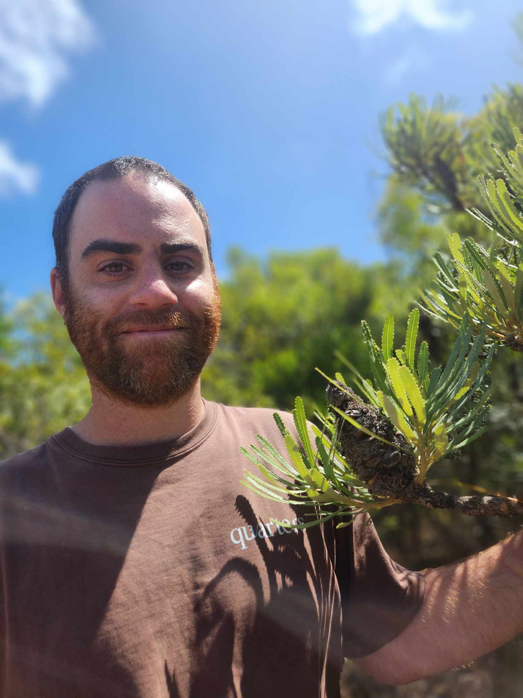

Hi, I'm an ARC DECRA Fellow in the [Macroevolution and Macroecology Group](http://www.macroevoeco.com/) at the [Australian National University](https://biology.anu.edu.au/research/divisions/ecology-and-evolution), exploring how environmental change shapes the origin and decline of biodiversity across the Asia-Pacific region.

My research explores biodiversity patterns and the evolutionary histories of the myriad plant and animal groups that shape them. I'm interested in why some areas, like tropical rainforests, consistently host high biodiversity. But I'm equally drawn to regions that challenge expectations about how biodiversity is formed, for example, the unexpectedly high diversity of reptiles in Australia's arid zone, or the remarkable richness of endemic plant species in Mediterranean-type climates around the globe. To investigate these topics, I integrate spatial, phylogenetic, and ecological-trait data combined with **simulation modeling** and **phylogenetic comparative methods**, while also considering how global change in the past, present, and future is reshaping these systems.

