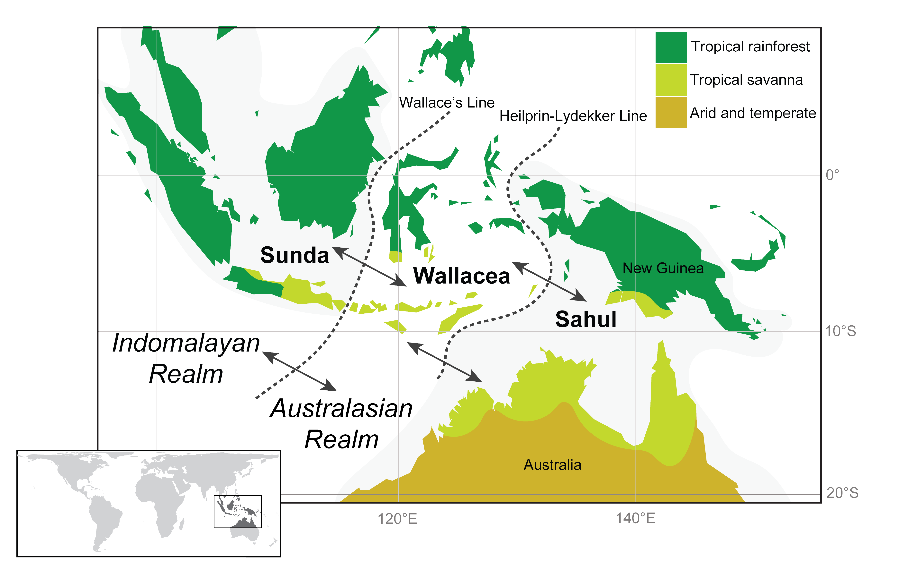
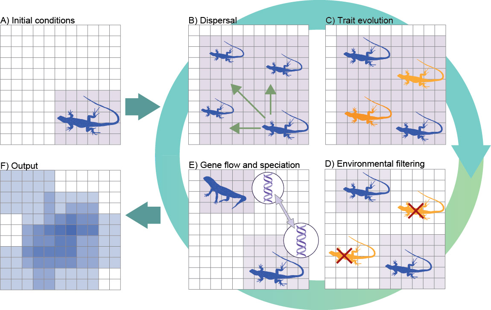
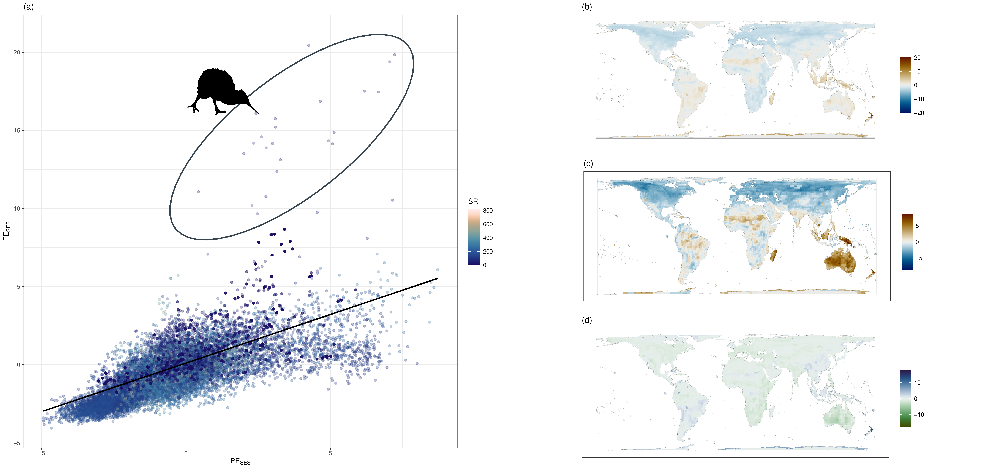
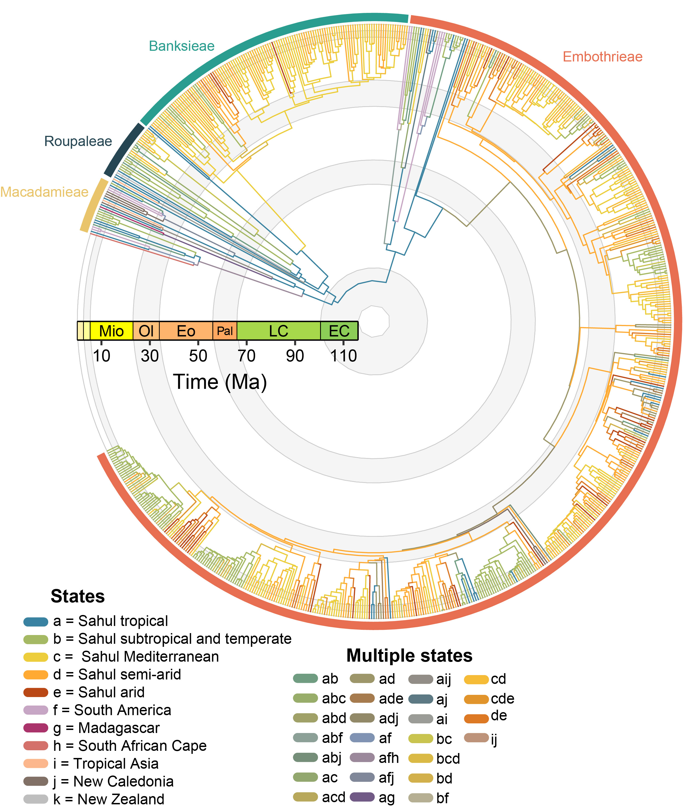

::: justify

::: {.research-section}
### Indo-Australian Biogeography

{width="650" fig-align="center"}

The Indo-Australian region is one of the most geologically and biologically complex areas on the planet and is shaped by the historical isolation of the Indian subcontinent and Sahul and dramatic biotic interchanges upon their more recent connections with Eurasia. I am deeply interested in understanding how these dynamic tectonic processes, alongside climatic change during the Cenozoic, have shaped the interchange of organisms in this region, shaping the diversity of different biomes from the equatorial rainforests of Borneo to the Australian arid zone.

::: {.related-papers}
**Selected papers**

- Skeels, A. et al. (2023). [Paleoenvironments shaped the exchange of terrestrial vertebrates across Wallace's Line](https://www.science.org/stoken/author-tokens/ST-1301/full). *Science*, 381, 86--92.
- Tiatragul, S. et al. (2023). [Paleoenvironmental models for Australia and the impact of aridification on blindsnake diversification](https://doi.org/10.1111/jbi.14700). *Journal of Biogeography*, 50, 1899--1913.
- Pavón-Vázquez, C. J. et al. (2022). [Competition and geography underlie speciation and morphological evolution in Indo-Australasian monitor lizards](https://onlinelibrary.wiley.com/doi/10.1111/evo.14403). *Evolution*, 76(3), 476--495.
:::
:::

::: {.research-section}
### Biodiversity Simulation Modelling

{width="650" fig-align="center"}

Simulation models allow us to experimentally manipulate the processes which shape diversification of lineages. They importantly allow us to link a complex array of ecological and evolutionary processes that are otherwise intractable to other classes of model.

I have been involved in developing new simulation tools (e.g., DREaD) and extending existing simulation frameworks to model novel processes (e.g., Gen3sis) in order to understand how fundamental processes such as the geographic mode of speciation, environmental niche evolution, and dispersal ability shape emergent biodiversity gradients.

My upcoming DECRA aims at extending this toolkit for biogeographers and evolutionary biologists -- stay tuned!

::: {.related-papers}
**Selected papers**

- Lorcery, M. et al. (2025). [Deep time evolution of the Latitudinal Diversity Gradient: Insights from mechanistic models](https://journals.plos.org/plosone/article?id=10.1371/journal.pone.0332766). *PLoS One*, 20(9), e0332766.
- Skeels, A. et al. (2023). [Paleoenvironments shaped the exchange of terrestrial vertebrates across Wallace's Line](https://www.science.org/stoken/author-tokens/ST-1301/full). *Science*, 381, 86--92.
- Skeels, A. et al. (2023). [Temperature-dependent evolutionary speed shapes the evolution of biodiversity patterns across tetrapod radiations](https://doi.org/10.1093/sysbio/syac048). *Systematic Biology*, 72(2), 341--356.
- Hagen, O.\* & Skeels, A.\* et al. (2021). [Earth history events shaped the evolution of uneven biodiversity across tropical moist forests](https://www.pnas.org/content/118/40/e2026347118). *PNAS*, 118(40), e2026347118.
- Skeels, A. & Cardillo, M. (2019). [Reconstructing the geography of speciation from contemporary biodiversity data](https://www.journals.uchicago.edu/doi/abs/10.1086/701125). *American Naturalist*, 193(2), 240--255.
:::
:::

::: {.research-section}
### Functional, Phylogenetic, and Geographic Endemism

{width="650" fig-align="center"}

Understanding why certain species are confined to particular places -- and why some regions harbour concentrations of unique, range-restricted lineages -- is a central question in biogeography. My work on endemism explores the ecological and evolutionary drivers of these patterns, from functional traits that characterise endemic species to the role of landscape connectivity in shaping endemism hotspots.

::: {.related-papers}
**Selected papers**

- Esquerré, D. & Skeels, A. (2026). [Biogeographic patterns of richness and endemism in Liolaemidae](https://doi.org/10.1007/978-3-032-00074-3_5). *Andean Herpetofauna*, Springer.
- Yuan, Z. et al. (2025). [The geography of connectivity shapes plant endemism hotspots](https://nsojournals.onlinelibrary.wiley.com/doi/full/10.1002/ecog.07514). *Ecography*, e07514.
- Skeels, A. & Yaxley, K. (2023). [Functional endemism captures hotspots of unique phenotypes and restricted ranges](https://doi.org/10.1111/ecog.06913). *Ecography*, e06913.
:::
:::

::: {.research-section}
### Phylogenetics and Evolutionary History of the Proteaceae

{width="650" fig-align="center"}

The Proteaceae are an iconic element of the Australian flora and they are widespread across the former Gondwanan southern continents and even into parts of tropical Asia. As part of my current research I have been inferring phylogenetic relationships in the large, globally distributed subfamily, Grevilleoideae.

Using phylogenomic data, we aim to untangle the causes of widespread discordance throughout the group and date divergences using a novel fossil dataset, in order to look at the group's biogeographic and diversification history in the context of historical biome change.

::: {.related-papers}
**Selected papers**

- Skeels, A. et al. (2025). [Paleobiome dynamics shaped a large Gondwanan plant radiation](https://www.pnas.org/doi/abs/10.1073/pnas.2502129122). *PNAS*, 122(29), e2502129122.
- Skeels, A. et al. (2024). [Sources of gene tree discordance in subtribe Hakeinae (Proteaceae)](https://ssbbulletin.org/index.php/bssb/article/view/9823). *Bulletin of the Society of Systematic Biologists*, 3(2).
- Nge, F. J. & Skeels, A. (2025). [Diversification patterns of the southwest Australian biodiversity hotspot](https://nph.onlinelibrary.wiley.com/doi/10.1111/nph.70330). *New Phytologist*, 248, 953--967.
- Skeels, A. & Cardillo, M. (2019). [Equilibrium and non-equilibrium phases in the radiation of Hakea](https://onlinelibrary.wiley.com/doi/abs/10.1111/evo.13769). *Evolution*, 73(7), 1392--1410.
- Skeels, A. & Cardillo, M. (2017). [Environmental niche conservatism explains the accumulation of species richness in Mediterranean-hotspot plant genera](https://onlinelibrary.wiley.com/doi/full/10.1111/evo.13179). *Evolution*, 71(3), 582--594.
:::
:::

:::
