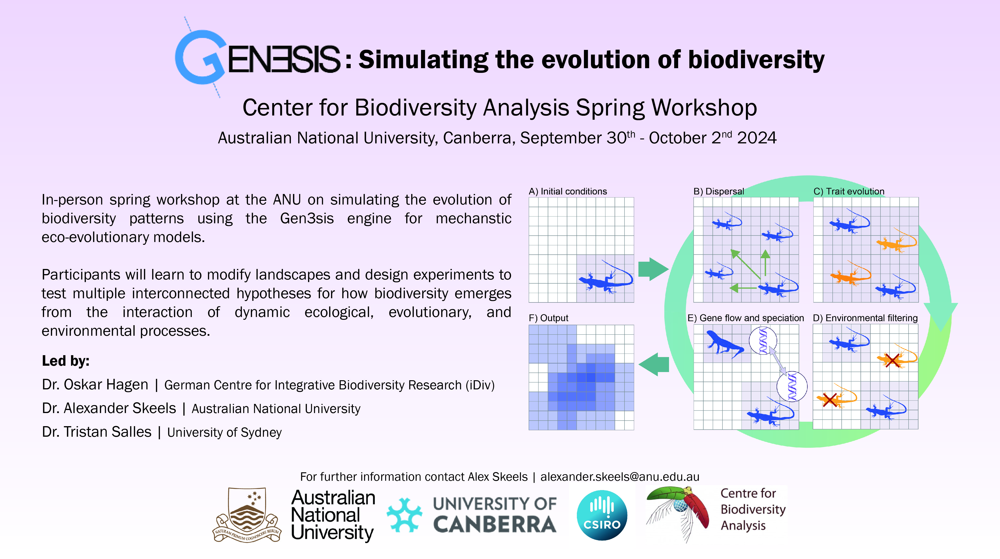
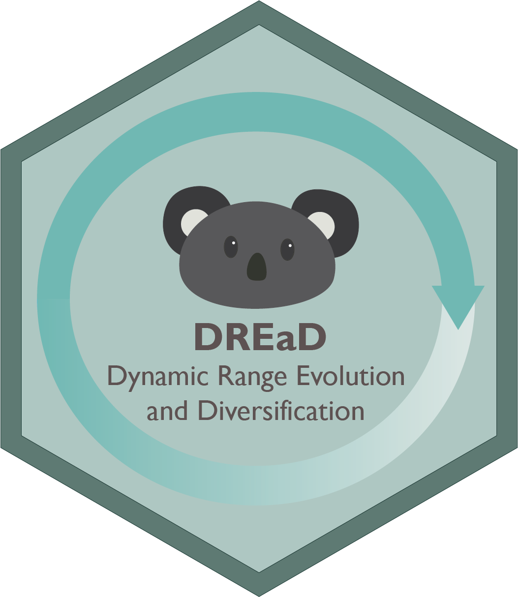
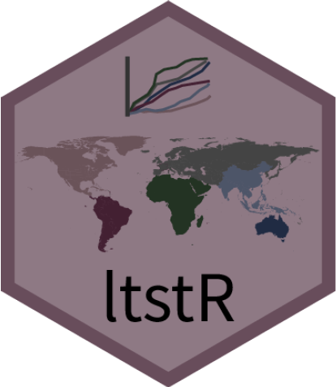

::: {.centered-content}
### Workshop Materials

[Center for Biodiversity Analysis: Gen3sis Workshop 2024](https://alexskeels.github.io/CBAGen3sis)

{width="500" fig-align="center"}

### R Tools

[DReAD: a package for biodiversity simulation](https://github.com/alexskeels/DynamicRangeEvolutionAndDiversification)

{width="300" fig-align="center"}

[ltstR: a package to visualize spatial and temporal changes in diversity](https://github.com/alexskeels/ltstR)

{width="300" fig-align="center"}

[waRhol: a colour palette for R based on the art of Andy Warhol](https://github.com/alexskeels/waRhol)
:::
